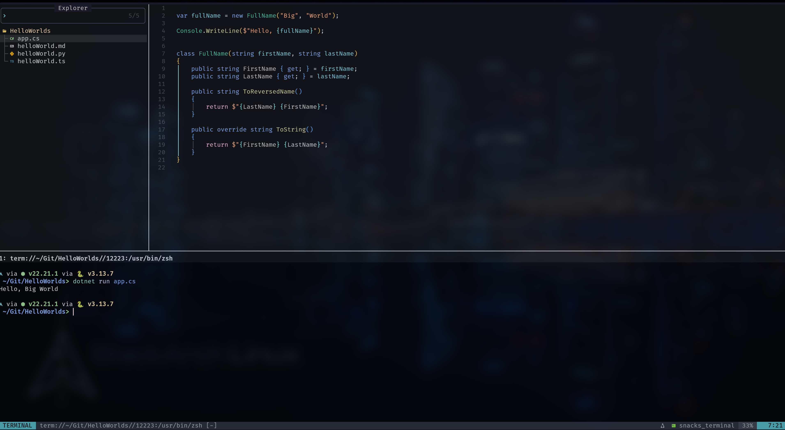
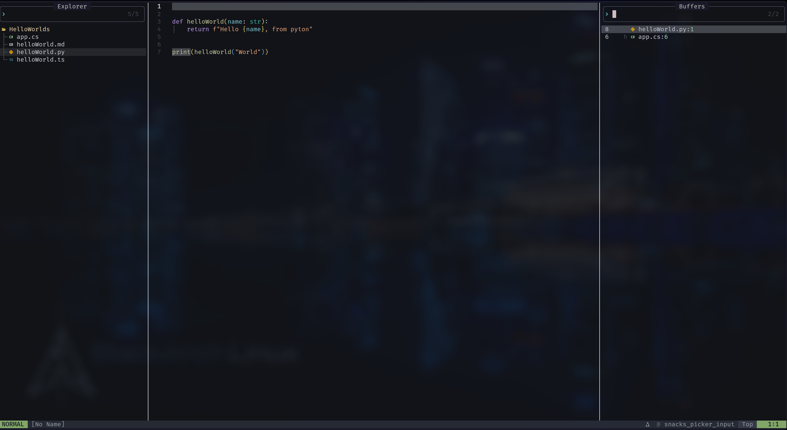

# Neovim Config

Personal Neovim configuration built around lazy.nvim and snacks.nvim.

## Requirements

- Neovim 0.10+ (recommended)
- Git
- A Nerd Font (optional, for icons)

## Install

Back up your existing Neovim config if you have one.

Linux/macOS:

```sh
git clone https://github.com/rmcfarlane82/rmc-neovim.git ~/.config/nvim
```

Windows (PowerShell):

```powershell
git clone https://github.com/rmcfarlane82/rmc-neovim.git $env:LOCALAPPDATA\nvim
```

First launch will auto-install plugins via lazy.nvim.

Useful commands:

```vim
:Lazy install
:Mason
```

Mason may fail to install some LSPs until prerequisites are installed:

- C#: .NET SDK
- Python: Python
- JavaScript/TypeScript: Node.js (npm)

## Usage Tips

Leader key is space.

- Find files: `<leader>ff`
- Live grep: `<leader>fg`
- File explorer: `<leader>e` or `<C-e>`
- Buffers list: `<leader>fb` (press `d` to delete a buffer)
- Show keymaps: `<leader>fk`
- Clear search highlight: `<Esc>`
- Exit insert/visual/terminal mode: `jk`
- Next diagnostic: `ge`
- Diagnostic float: `<leader>d`
- Diagnostics picker: `<leader>D`
- Lazygit: `<leader>ga` (requires `lazygit` installed)
- Toggle markdown preview: `<leader>mv`
- Window navigation: `<C-h>`, `<C-j>`, `<C-k>`, `<C-l>`

## Terminals

- Horizontal terminal: `<A-h>` (use a count like `2<A-h>` for another terminal)
- Vertical terminal: `<A-v>` (use a count like `2<A-v>` for another terminal)
- Floating terminal: `<A-f>` (use a count like `2<A-f>` for another terminal)
- Terminal picker: `<leader>ft`

Picker keys (terminal picker):

- `<Enter>`: open and focus the terminal (closes picker)
- `o`: open the terminal and keep the picker open
- `c`: close/hide the terminal
- `d`: delete the terminal buffer
- `q`: close the picker

## Screenshots

### Home Screen


### C# Editing



### Buffers with Snacks.Nvim (great package)



## Notes

Windows: you may need to install `fd` and `zig`.

- Plugins are managed by `lazy.nvim`.
- Keymaps live in `lua/config/keymaps.lua`.
- Snacks picker settings live in `lua/config/snacks-picker.lua`.
